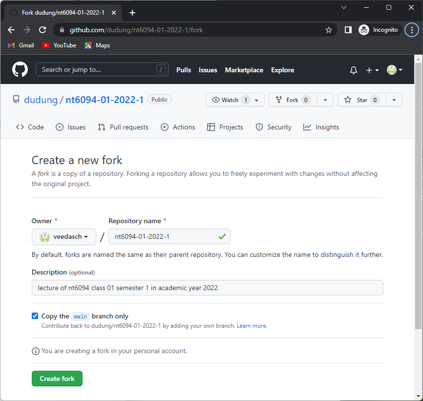
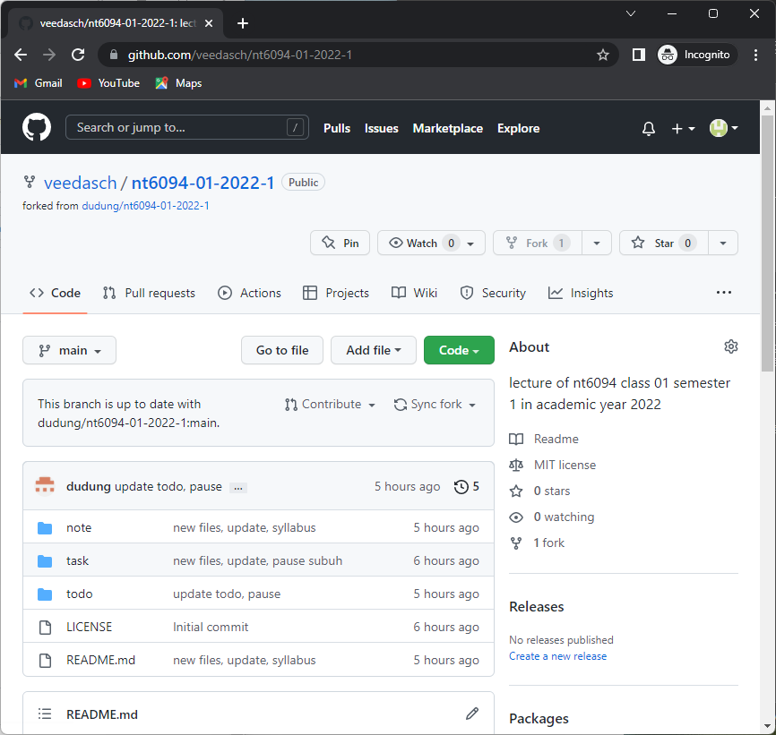

# 01
Register to GitHub, fork this repo, and comment on [#1](https://github.com/dudung/nt6094-01-2022-1/issues/1)

user
 | nim | fork | comment
:- | :-: | :-: | :-:
user |  | :heavy_check_mark: | :x:

## information
+ [comment](https://github.com/dudung/nt6094-01-2022-1/issues/1)
+ [list of fork](https://github.com/dudung/nt6094-01-2022-1/network/members)

## steps
1. [Fork](https://github.com/dudung/nt6094-01-2022-1/fork) this repository. 
  

2. This repository is [forked](https://github.com/veedasch/nt6094-01-2022-1). 
  