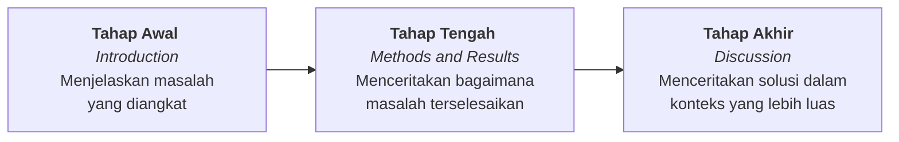
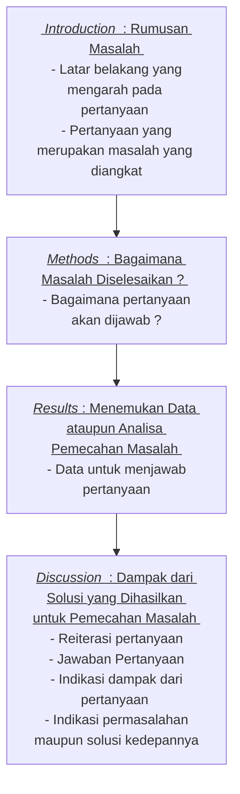

# 28721003
1. Ganti nim dia atas dengan NIM Anda, seperti 99921001.
2. Hanya berkas ini yang akan diperiksa, sehingga bila ada jawaban yang tercantum pada berkas lain, tautan dari berkas ini ke berkas lain tersebut harus dibuat dan tercantum pada berkas ini.
3. Kerjakan yang diberikan berikut ini.


## soal 0
Pelajari
+ [Dasar-dasar cara menulis dan memformat berkas Markdown di Github](https://docs.github.com/en/get-started/writing-on-github/getting-started-with-writing-and-formatting-on-github/basic-writing-and-formatting-syntax)<br>(akan diterapkan pada tautan **Jawaban** di bawah setiap soal dan isi berkas yang dirujukanya),
+ [Dasar-dasar sintaks Mermaid untuk membuat diagram alir di GitHub](https://mermaid-js.github.io/mermaid/#/flowchart)<br>
(akan digunakan pada saat membuat digram alir proses pengerjaan artikel ilmiah),
+ [Cara menulis persamaan matematika dengan Markdown di GitHub](https://docs.github.com/en/get-started/writing-on-github/working-with-advanced-formatting/writing-mathematical-expressions)<br>
(akan dimanfaatkan saat menampilkan persamaan matematika yang digunakan).


## soal 1
Bagaimana Anda dapat menentukan suatu jurnal termasuk dalam kategori Q4, Q3, Q2, atau Q1? Jelaskan dan cantumkan tautan ke sumber yang diperlukan.

###### Jawaban Soal 1
Untuk mengetahui suatu jurnal merupakan jurnal Q4, Q3, Q2 atau Q1 dapat dilihat dari SJR (SCImago Journal Rank). Dimana SJr indikator merupakan ukuran pengaruh ilmiah dari suatu jurnal ilmiah yang diperhitungkan dari jumlah kutipan yang diperoleh dari jurnal tersebut dan pentingnya atau 'prestise' sebuah jurnal yang mengutip dari jurnal sumber. SJR dari suatu jurnal adalah nilai numerik yang menunjukkan jumalh rata-rata kutipan tertimbang tang diterima selama tahun terpilih dihitung 3 tahun sejak dokumen diterbitkan dalam jurnal tersebut. Untuk mengetahui tingkatan SJR dapat dilihat pada [laman berikut](https://www.scimagojr.com/)


## soal 2
Tuliskan empat jurnal bidang Anda, yang mungkin kelak akan menjadi target Anda mengirimkan artikel ilmiah, dengan masing-masing termasuk dalam kategori Q4, Q3, Q2, dan Q1. Cantumkan pula tautan ke jurnal-jurnal tersebut dan situs web lain yang menyatakan bahwa jurnal-jurnal tersebut termasuk dalam kategori yang dimaksud.

###### Jawaban Soal 2
Target jurnal tujuan :
+ Q1 : Food Hydrocolloids (h-index : 174). Tautan [Homepage](https://www.sciencedirect.com/journal/food-hydrocolloids) [SJR Scimago](https://www.scimagojr.com/journalsearch.php?q=22597&tip=sid&clean=0)
+ Q2 : Q2 : Food Process Engineering (H-index : 49). Tautan : [Homepage](https://onlinelibrary.wiley.com/page/journal/17454530/homepage/productinformation.html) [SJR Scimago](https://www.scimagojr.com/journalsearch.php?q=20589&tip=sid&clean=0)
+ Q3 : Czech Journal of Food Science (H-index : 45). Tautan : [Homepage](https://www.agriculturejournals.cz/web/cjfs/) [SJR Scimago](https://www.scimagojr.com/journalsearch.php?q=21964&tip=sid&clean=0)
+ Q4 : Food Science and Technology (H-index : 8). Tautan : [Homepage](https://ifst.onlinelibrary.wiley.com/hub/journal/26891816/homepage/productinformation.html) [SJR Scimago](https://www.scimagojr.com/journalsearch.php?q=23203&tip=sid&clean=0)


## soal 3
Jelaskan apa yang dimasksud dengan struktur organisasi suatu artikel ilmiah IMRaD? Cantumkan rujukan yang Anda gunakan untuk menjelaskan.

###### Jawaban Soal 3
Struktur organisasi IMRaD pada artikel ilmiah adalah salah satu singkatan dari struktur penulisan artikel ilmiah berupa *Introduction, Methods, Results and Discussion*. Struktur penulisan IMRaD pertama kali dikenalkan pada buku yang ditulis oleh Louis Pasteur yang diterbitkan pada tahun 1876. IMRad mulai diadopsi di artikel ilmiah pada tahun 1940-an. Saat ini IMRaD banyak digunakan sebagai struktur penulisan artikel ilmiah karena struktur organisasi ini menyediakan konsistensi dari kerangka kerja yang membantu penulis untuk merumuskan pertanyaan esensial untuk memahami studi yang dilakukan. IMRaD ini dimulai dengan *Introduction* yang digunakan untuk menjawab pertanyaan "Mengapa peneliti/penulis melakukan studi terkait?", kemudian struktur *Methods* yang digunakan untuk menjawab pertanyaan "Bagaimana anda melakukan studi tersebut?", struktur ketiga berupa *Results* untuk menjawab pertanyaan "Apa yang anda temukan saat malakukan studi tersebut?" dan struktur terakhir berupa *Discussion* untuk menjawab pertanyaan "Apa arti atau makna dari penemuan tersebut?". Berdasarkan hal tersebut menurut beberapa praktisi penulisan artikel ilmiah, IMRaD menwarkan berbagai keuntungan seperti membantu penulis mengorganisir ide dan mengingat elemen kritikal sat penulisan, membantu mempermudah editor dan reviewer untuk mengevaluasi manuskrip dan meningkatkan efisiensi dari penulis untuk meletakkan informasi spesifik tanpa harus menjelaskannya disepanjang manuskrip.
+ **Sumber :** [Wu, J. Improving the writing of research papers: IMRAD and beyond. Landscape Ecol 26, 1345–1349 (2011)](https://doi.org/10.1007/s10980-011-9674-3)


## soal 4
Terkait dengan struktur artikel limiah menurut IMRaD, buat diagram alir dengan Mermaid untuk menggambarkan urut-rutan bagian yang dikerjakan dan iterasi yang diperlukan. Cantumkan rujukan yang digunakan.

###### Jawaban Soal 4
Secara umum penulisan artikel ilmiah dengan struktur IMRaD dapat dilakukan sebagai berikut :



Detail struktur artikel dengan organisasi IMRaD dapat digambarkan sebagai berikut :

    
+ **Sumber** : [Montagnes, D.J.S., Montagnes, E.I. & Yang, Z. Finding your scientific story by writing backwards. Mar Life Sci Technol 4, 1–9 (2022)](https://doi.org/10.1007/s42995-021-00120-z)

## soal 5
Cantumkan sebuah persamaan utama yang akan digunakan dalam penelitian Anda, dapat dalam bagian teori, pengambilan data, pengolahan data, ataupun analisis.

###### Jawaban Soal 5
Beberapa persamaan yang digunakan pada penelitian saya , antara lain : 
+ Persamaan *Water Vapor Permeability*

$WVP = \frac{WVTR\times L}{\Delta p}$

+ Persamaan Nilai Transparansi

$Transparansi = \frac{log%T}{b}$

## soal 6
Apakah yang dimaksud dengan jurnal pemangsa? Apakah yang dimaksud dengan penerbit pemangsa? Apakah perbedaannya dengan jurnal pemangsa? Jelaskan dengan memberikan rujukan yang digunakan.

###### Jawaban Soal 6
Jurnal pemangsa adalah jurnal yang mengkalim sebagai jurnal ilmiah yang sah tetapi salah menggambarkan praktik penerbitannya. Beberapa bentuk umum dari praktik ini antara lain secara keliru mengklaim untuk memberikan tinjauan sejawat, menyebunyikan informasi tentang Biaya Pemrosesan Artikel (APC), salah mngartikan anggota dewan editorial jurnal dan pelanggaran hak cipta atau etik ilmiah lainnya [1]. Penerbit pemangsa adalah seseorang atau suatu organisasi yang mempublikasikan jurnal palsu atau jurnal yang biasanya tidak memenuhi standar ilmiah untuk mengekploitasi model open access yang seringkali dibiayai oleh penulis dari artikel terkait. Kebanyakan penerbit pemangsa biasanya tidak mengikuti kebijakan yang diatur oleh organisasi seperti *World Association of Medical Editors* (WAME), *the Commitee on Publicaton Ethics* (COPE), *the Council of Science Editors* (CSE) and *the International Committee of Medical Journal Editors* (ICMJE) [2]. Pada intinya baik jurnal pemangsa maupun penerbit pemangsa memiliki tujuan yang sama yakni profit atau keuntungan. Mereka berusaha menipu penulis untuk menerbitkan artikel dengan biaya tertentu tanpa menyediakan layanan peer-review atau editorial, sehingga menempatkan keuntungan atas nama sains yang dapat dipercaya dan diandalkan [1].
+ **Sumber :**
1. [Elmore SA, Weston EH. Predatory Journals: What They Are and How to Avoid Them. Toxicol Pathol. (2020)](https://www.ncbi.nlm.nih.gov/pmc/articles/PMC7237319/)
2. [Shah FA, Nazar Z. Predatory Journals: A global threat to the scholarly publishing landscape. J Postgrad Med Inst 2020; 34(1): 1-4](https://www.researchgate.net/publication/343962161_Predatory_Journals)


## soal 7
Apa yang dimaksud dengan jurnal akses terbuka? Jelaskan dengan memberikan rujukan yang digunakan.

###### Jawaban Soal 7
Jurnal dengan akses terbuka adalah jurnal ilmiah yang menerbitkan artikel ilmiah dan membuat konten ilmiah yang tersedia untuk dapat diakses, diunduh, dibaca dan didistribusikan tanpa memungut biaya berlangganan. terdapat dua pendekatan dari akases terbuka ini menurut BOAI (Budapest Open Acess Initiative) antara lain akses terbuka emas yang merupakan akses terbuka yang tesedia langsung dari penerbit dan akses terbuka hijau yang merupakan publikasi yang tersedia melalui pengarsipan mandiri oleh penulis. 
+ **Sumber :** [Li Y, Wu C, Yan E, Li K. Will open access increase journal CiteScores? An empirical investigation over multiple disciplines. PLoS One. (2018)] (https://journals.plos.org/plosone/article?id=10.1371/journal.pone.0201885)


## soal 8
Apakah ada kaitan antara jurnal pemangsa dengan jurnal akses terbuka? Jelaskan dengan memberikan rujukan yang digunakan.

###### Jawaban Soal 8
Jurnal dengan akses terbuka merupakan publikasi dengan layanan digitan, online yang tidak dikenakan biaya dan bebas dalam maslah lisesi dan percetakannya. pada dasarnya, akses terbuka berarti bahwa itu gratis bagi para pembaca untuk penggunaan akademis atau ilmiah dan bebas dari batasan hak cipta. Namun, jurnal jenis ini biasanya tidak gratis untuk diproduksi dan biaya dibebankan umu,nya kepada penulis maupun lembaga penelitian. Maka dari itu, jenis model jurnal dengan akses terbuka seringkali menjadi begitu mencurigakan karena penerbitan dengan akses terbuka adalah model yang biasanya digunakan oleh banyak penerbit yang sah, tetapi juga digunakan oleh penerbit atau jurnal pemangsa. akses terbuka diperkirakan telah berkontribusi pada menjamurnya jurnal pemangsa yang memanfaatkan penulis yang ingin menerbitkan manuskrip mereka. Jurnal pemangsa biasanya memanfaatkan ini untuk dapat menawarkan penerbitan manusrip dengan cepat tanpa memiliki struktur kepemimpinan editorial yang jelas dan tanpa proses peninjauan naskah yang jelas. untuk mengantisipasi hal ini, jurnal dengan akses terbuka dapat dilihat dalam the Directory Open Access Journals (DOAJ).
+ **Sumber :** [Pearson GS. Open Access and Predatory Journals: Two Very Different Entities. Journal of the American Psychiatric Nurses Association. 2016;22(6):447-448](https://journals.sagepub.com/doi/full/10.1177/1078390316668478))    


## soal 9
Apa yang dimaksud dengan pengindeks jurnal? Sebutkan beberapa di antaranya yang Anda kenal. Cantumkan rujukan yang digunakan.

###### Jawaban Soal 9
Pengindeks jurnal adalah lembaga atau organisasi yang melakukan indeksasi jurnal berdasarkan kualitas jurnal. Indeksasi jurnal dianggap sebagai cerminan dari kualitasnya. Jurnal yang terindeks dinilai memiliki kualitas keilmuan yang lebih tinggi dibandingkan dengan jurnal yang tidak terindeks. Beberapa pengindeks jurnal antara lain : Scopus, SCIMAGOJR, PubMed, DOAJ, EMBASE, BASE, Open J Gate, Primo Central, dll
+ **Sumber :** [Balhara YP. Indexed journal: What does it mean? Lung India. 2012 Apr;29(2):193.](https://journals.lww.com/lungindia/Fulltext/2012/29020/Indexed_journal__What_does_it_mean_.25.aspx)


## soal 10
Apa yang dimaksud dengan h-indek? Jelaskan dengan memberikan rujukan yang digunakan. Hitunglah h-indeks seorang peneliti bila sitasi dari artike-artikel ilmiahnya adalah sebagai berikut.

```
paper =  21
citation =  [18, 6, 7, 18, 7, 6, 16, 8, 12, 17, 9, 12, 18, 10, 13, 8, 6, 14, 5, 5, 15] 
```

###### Jawaban Soal 10
H-indeks adalah metrik atau numerikal tingkat penulis yang mengukur produktivitas dan dampak kutipan dari publikasi, yang awalnya digunakan untuk ilmuwan maupun individu dalam kepentingan ilmiah. Dimana produktivitas dilihat dari kuantitas dari manurskrip yang telah terpublikasi sementara dampat dilihat dari jumlah sitasi yang diperoleh dari artikel atau manuskrip yang telah terpublikasi. 
Cara menghitung h-indeks.
1. Tuliskan seluruh artikel beserta jumlah sitasinya dalam satu tabel
2. Urutkan data tersebut berdasarkan jumlah sitasi terbanyak
3. Hitung h-indeks dengan mencari data dimana urutan data lebih besar dari jumlah sitasi pada data tersebut.

Perhitungan h indeks pada soal sebagai berikut: 
1. Tuliskan data pada soal

2. Urutkan data dan tentukan nilai h-indeks


Dari tahapan diatas. diketahui bahwa **nilai h-indeks peneliti tersebut adalah 10**

