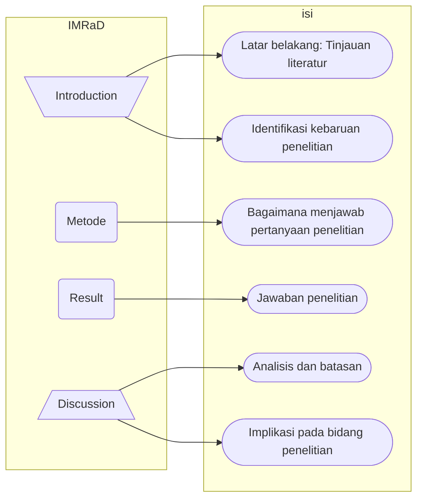

# 30621008
1. Ganti nim dia atas dengan NIM Anda, seperti 99921001.
2. Hanya berkas ini yang akan diperiksa, sehingga bila ada jawaban yang tercantum pada berkas lain, tautan dari berkas ini ke berkas lain tersebut harus dibuat dan tercantum pada berkas ini.
3. Kerjakan yang diberikan berikut ini.


## soal 0
Pelajari
+ [Dasar-dasar cara menulis dan memformat berkas Markdown di Github](https://docs.github.com/en/get-started/writing-on-github/getting-started-with-writing-and-formatting-on-github/basic-writing-and-formatting-syntax)<br>(akan diterapkan pada tautan **Jawaban** di bawah setiap soal dan isi berkas yang dirujukanya),
+ [Dasar-dasar sintaks Mermaid untuk membuat diagram alir di GitHub](https://mermaid-js.github.io/mermaid/#/flowchart)<br>
(akan digunakan pada saat membuat digram alir proses pengerjaan artikel ilmiah),
+ [Cara menulis persamaan matematika dengan Markdown di GitHub](https://docs.github.com/en/get-started/writing-on-github/working-with-advanced-formatting/writing-mathematical-expressions)<br>
(akan dimanfaatkan saat menampilkan persamaan matematika yang digunakan).


## soal 1
Bagaimana Anda dapat menentukan suatu jurnal termasuk dalam kategori Q4, Q3, Q2, atau Q1? Jelaskan dan cantumkan tautan ke sumber yang diperlukan.

+ [Jawaban]()

Penentuan kategori Q1-Q4 pada jurnal umumnya dilakukan dengan menggunakan beberapa metrik berbeda yang digunakan untuk mengukur dan mengevaluasi kualitas publikasi ilmiah. Beberapa kriteria diperlukan dalam pengukuran dan evaluasi dari publikasi ilmiah yang dihasilkan [^1], seperti:
1.	jumlah karya yang diterbitkan
2.	jumlah total kutipan yang diterima
3.	jumlah rata-rata kutipan per karya yang diterbitkan
4.	jumlah karya penting yang diterbitkan
5.	jumlah kutipan yang diterima oleh karya yang paling sering dikutip

Kriteria tersebut melahirkan istilah publikasi yang “berdampak”, yaitu publikasi yang terindeks di portal informasi yang mengukur kualitas dan visibilitas materi yang dipublikasikan. Oleh karena itu matrik yang digunakan pada jurnal disebut juga sebagai indikator dampak atau yang lebih sering dikenal dengan istilah *impact factor* (IF). IF mengukur dampak jurnal terhadap literatur ilmiah. IF diukur dengan menganalisis rerata tahunan kutipan yang diterima oleh artikel yang diterbitkan dalam jurnal tersebut. IF mengukur pentingnya publikasi dalam area subjek tertentu dengan membuat perbandingan dan relevansi judul di bidang yang terkait juga peringkat jurnal.
Setiap kategori subjek jurnal dibagi menjadi empat kuartil atau kategori: Q1, Q2, Q3, Q4. Q1 ditempati oleh 25% jurnal teratas dalam daftar; Q2 ditempati oleh jurnal dalam kelompok 25 sampai 50%; Q3 ditempati oleh jurnal di kelompok 50 sampai 75% dan Q4 ditempati oleh jurnal di kelompok 75 sampai 100%. Jurnal paling bergengsi dalam suatu bidang subjek adalah yang menempati kuartil pertama, Q1.
Saat ini terdapat dua platform yang menjadi database acuan utama untuk mencari dan menghitung IF dari jurnal ilmiah[^1], yaitu: 
1. [Journal Citation Reports (JCR)](http://mjl.clarivate.com/)
JCR dapat diakses secara online menggunakan akun berlisensi (berbayar) melalui platform Web Of Science (WOS) dan dapat digunakan untuk menjalankan pencarian online dan mencari *Impact factor* dari jurnal tertentu atau sekelompok jurnal dan membuat perbandingan di antara keduanya. Faktor dampak dihitung setiap tahun oleh *Institute for Scientific Information* (ISI). JCR mencakup 200 disiplin ilmu yang berbeda dan publikasi ditinjau dari banyaknya kutipan oleh para ahli di dunia.

2. [SCIMAGO Journal and Country Rank (SJR)](https://www.scimagojr.com/journalsearch.php)
Database pemeringkat SCIMAGO adalah alternatif gratis jika dibandingkan dengan JCR. Database ini digunakan untuk menganalisis publikasi yang diindeks dalam database Scopus yang disediakan oleh penerbit Elsevier, dari tahun 1997 s.d saat ini.  SJR tidak mengukur kualitas sebuah artikel melainkan kualitas jurnal tempat artikel tersebut diterbitkan. IF diperbarui setiap tahun dan dapat bervariasi dari satu tahun ke tahun lainnya. SJR mencakup lebih banyak jurnal daripada JCR, sehingga kurang selektif. SJR umumnya digunakan dalam ilmu sains dan ilmu sosial. Tidak ada versi terpisah untuk setiap bidang subjek. SJR dapat membantu kita untuk mencari jurnal berdasarkan area penelitian, kategori, bahkan asal negara dimana jurnal tersebut diterbitkan. Melalui SJR ini juga kita bisa mengkonfirmasi tahun terbit jurnal (apakah masih terindeks atau tidak).Cara untuk mengakses SJR adalah sebagai berikut [^2][^3]:
     1. Masuk ke web [Scimago](https://www.scimagojr.com/journalsearch.php)
     2. Masukkan judul jurnal ke dalam pencarian dan pilih yang diperlukan dari daftar.
         Contoh: 
          -	Subject Area misal:		 Agriculture
          -	Subject Categories, misal:	 Food Science
          -	Region/countries, misal: 	Indonesia
          -	Type: 			Journal/Proceeding/Book

      3. Masuk ke halamannya dan setelah karakteristik jurnal, kita dapat melihat tabel dengan data tentang kuartil di dalamnya.
      > Ada juga menu penyaring untuk memilih daftar jurnal *Open Access* dan pilihan untuk melihat apakah jurnal yang kita cari juga terindeks WoS (selain terindeks scopus sebagai “pemilik” website ini). Selain melalui Scimago, kita bisa akses ke [Scopus Journal Metrics (SJM)](https://www.scopus.com/sources.uri) untuk melihat publikasi berdasarkan kuartil dan SJR

[^1]: https://www.mondragon.edu/en/web/biblioteka/publications-impact-indexes
[^2]: https://spubl.kz/en/blog/kak-opredelit-kvartil-zhurnala-v-scopus-i-web-of-science
[^3]: https://heriakhmadi.com/2021/12/29/memilah-dan-memilih-jurnal-q1-bereputasi-dan-impact-factor-tinggi-untuk-publikasi/


## soal 2
Tuliskan empat jurnal bidang Anda, yang mungkin kelak akan menjadi target Anda mengirimkan artikel ilmiah, dengan masing-masing termasuk dalam kategori Q4, Q3, Q2, dan Q1. Cantumkan pula tautan ke jurnal-jurnal tersebut dan situs web lain yang menyatakan bahwa jurnal-jurnal tersebut termasuk dalam kategori yang dimaksud.

+ [Jawaban]()

| No. | Kategori Jurnal | Nama Jurnal | Konfirmasi Kategori Jurnal |
| :---: | :---: | --- | --- |
| 1 | Q1 | [LWT - Food Science and Technology](https://www.sciencedirect.com/journal/lwt) | [Scimago](https://www.scimagojr.com/journalsearch.php?q=20744&tip=sid&clean=0)<br> [Scopus](https://www.scopus.com/sourceid/20744)|
| 2 | Q2 | [Food Science and Technology International](https://journals.sagepub.com/home/fst) | [Scimago](https://www.scimagojr.com/journalsearch.php?q=23189&tip=sid&clean=0)<br> [Scopus](https://www.scopus.com/sourceid/23189) |
| 3 | Q3 | [BIOTROPIA-The Southeast Asian Journal of Tropical Biology](https://www.sciencedirect.com/journal/lwt) | [Scimago](https://journal.biotrop.org/index.php/biotropia)<br> [Scopus](https://www.scopus.com/sourceid/20500195080) |
| 4 | Q4 | [Journal of tropical life science](https://jtrolis.ub.ac.id/index.php/jtrolis) | [Scimago]( https://www.scimagojr.com/journalsearch.php?q=21101030126&tip=sid&exact=no)<br> [Scopus]( https://www.scopus.com/sourceid/21101030126) |


## soal 3
Jelaskan apa yang dimasksud dengan struktur organisasi suatu artikel ilmiah IMRaD? Cantumkan rujukan yang Anda gunakan untuk menjelaskan.

+ [Jawaban]()

Metode IMRaD *(Introduction, Method, Result and Discussion)* dikenal sebagai salah satu satu struktur penulisan artikel ilmiah yang umum digunakan dan diterima oleh banyak jurnal ilmiah bereputasi. Berikut adalah penjelasan singkat tentang metode IMRaD[^4] [^5] [^6]:
1. **Introduction** (Pendahuluan): Berisi tentang latar belakang penelitian, keunikan/masalah yang diangkat dari penelitian, tinjauan pustaka (*literature review*) dan kebaruan penelitian (*Research Gap*).
2. **Method** (Metode penelitian): Pada bagian ini diuraikan mengenai metode penelitian, meliputi subyek, variabel, instrumen, teknik dan analisis data yang digunakan untuk memecahkan permasalahan yang diajukan.
3. **Result** (Hasil penelitian): Bagian hasil berisi penjelasan tentang hasil penelitian. Hasil penelitian dapat disajikan dalam bentuk tabel, grafik, atau gambar, yang dimulai dengan narasi lalu diikuti dengan tabel atau gambar. Narasi digunakan untuk menyoroti metode dan hasil mana yang paling signifikan atau penting dari penelitian.
4. **Discussion** (Pembahasan): Berisi penjelasan dan kesesuaian dari hasil penelitian yang diperoleh. Hasil dibahas dengan kajian teori penelitian yang relevan atau hasil dari penelitian lain.

-- Penutup atau kesimpulan dapat ditulis pada bagian diskusi atau terpisah. Bagian ini menjelaskan kesimpulan yang merupakan jawaban atas pertanyaan penelitian, hipotesis atau rumusan masalah. Kesimpulan merupakan turunan yang logis dari hasil penelitian dalam menjawab pertanyaan penelitian atau hipotesis yang diajukan. 
[^4]: https://matematika.fmipa.unesa.ac.id/2183/mengenal-struktur-imrad-dan-tips-menulis-judul-artikel-ilmiah-yang-baik/#:~:text=Apa%20itu%20IMRAD%3F,oleh%20banyak%20jurnal%20ilmiah%20bereputasi.
[^5]: https://mti.binus.ac.id/2017/12/05/4-resep-sederhana-menulis-makalah-internasional-scopus/
[^6]: https://www.lluiscodina.com/wp-content/uploads/2021/04/IMRYD-JARS-2021-EN.pdf


## soal 4
Terkait dengan struktur artikel limiah menurut IMRaD, buat diagram alir dengan Mermaid untuk menggambarkan urut-rutan bagian yang dikerjakan dan iterasi yang diperlukan. Cantumkan rujukan yang digunakan.

+ [Jawaban]()
Berikut merupakan diagram alir mengenai urutan pengerjaan artikel berdasarkan IMRaD [^7][^8]:


[^7]:https://link.springer.com/article/10.1007/s10980-011-9674-3
[^8]:https://www.adinstruments.com/blog/tips-writing-scientific-paper


## soal 5
Cantumkan sebuah persamaan utama yang akan digunakan dalam penelitian Anda, dapat dalam bagian teori, pengambilan data, pengolahan data, ataupun analisis.

+ [Jawaban]()

**Rumus Pengenceran Larutan**

$$ {V1*M1 = V2*M2} $$

$$ V2 = {(V1 * M1) \over (M2)} $$  
 
_Keterangan_:<br>
V1 = volume larutan pekat (L) <br>
M1 = konsentrasi larutan pekat (M)<br>
V2 = volume larutan encer (L)<br>
M2 = konsentrasi larutan encer (M)<br>
 

## soal 6
Apakah yang dimaksud dengan jurnal pemangsa? Apakah yang dimaksud dengan penerbit pemangsa? Apakah perbedaannya dengan jurnal pemangsa? Jelaskan dengan memberikan rujukan yang digunakan.

+ [Jawaban]()

Sejak munculnya kategori jurnal dan penerbit pemangsa, banyak peneliti atau komunitas yang menganggap belum ada definisi tepat yang bisa digunakan untuk keduanya, namun [nature pada tahun 2019](https://www.nature.com/articles/d41586-019-03759-y) mendeskripsikan keduanya sebagai berikut: 
>“Jurnal dan penerbit predator adalah entitas yang memprioritaskan kepentingan pribadi dengan mengorbankan pengetahuan dan dicirikan oleh informasi yang salah atau menyesatkan, penyimpangan dari tata laksana editorial dan publikasi yang baik, kurangnya transparansi, dan/atau adanya tindakan persuasif yang agresif dan sewenang-wenang.”

Jurnal dan penerbit pemangsa adalah sebuah model bisnis dalam bidang penerbitan dan publikasi akademik yang membebankan biaya penerbitan tulisan kepada penulis tanpa melakukan proses pemeriksaan mutu dan keabsahan tulisan di dalamnya. Berbeda halnya dengan penerbit kaliber yang memiliki dewan redaksi (editorial) yang bertugas memeriksa karya tulis yang dihasilkan. Perbedaan utama antara penerbit pemangsa dan jurnal pemangsa adalah output yang dihasilkan. Luaran penerbit biasanya ditujukan untuk masyarakat umum, sedangkan jurnal ditujukan untuk akademisi atau peneliti. Publikasi dapat berupa buku teks, koran, majalah, pamflet, monograf, dan lain sebagainya. Jurnal adalah publikasi ilmiah yang memuat berbagai artikel (hasil penelitian, komunikasi pendek, atau ulasan penelitian) yang ditulis oleh profesor, peneliti, dan pakar lainnya pada bidang tertentu yang ditujukan pada pembaca spesifik [^9][^10][^11][^12]. 

Normalnya, baik dalam dunia penerbitan maupun publikasi, dilakukan proses editing oleh tim redaksi atau *peer-review* untuk memastikan kualitas tulisan baik tanpa unsur plagiat, tidak menyebarkan informasi yang salah dan tidak melanggar etika. Namun, kenyataannya penerbit dan jurnal pemangsa melakukan praktik-praktik tidak etis dan merusak kualitas, integritas, dan kredibilitas karya ilmiah yang diterbitkan. Daftar Jurnal dan penerbit pemangsa dapat diakses salah satunya pada web [Beallslist] (https://beallslist.net/). Di bawah ini, merupakan ciri-ciri dari jurnal dan penerbit pemangsa yang perlu dihindari[^13][^14][^15]:
1.	Jurnal meminta biaya submisi alih-alih biaya publikasi dengan nominal yang tidak sedikit.
2.	Jurnal atau penerbit pemangsa sering mengirim email spam terus-menerus menggunakan email dengan domain public, seperti @gmail.com, @yahoo.com.
3.	Daftar dewan redaksi sedikit atau tidak tertulis. Jika ada, biasanya mengambil profil peneliti dari universitas, atau melampirkan informasi yang tidak dapat diverifikasi.
4.	Merilis banyak jurnal baru dalam satu waktu yang bersamaan (proses publikasi cepat).
5.	Menawarkan issue dalam waktu dekat tapi tidak pernah ada.
6.	Tidak transparan mengenai proses peer review, kebijakan editorial, jadwal publikasi, perjanjian hak cipta, dan biaya yang tercantum.
7.	Website tidak professional, banyak *typo* dan iklan yang tidak berhubungan, sulit untuk dinavigasi (menemukan pengelola publikasi sebenarnya). Contoh: menggunakan alamat palsu yang tidak dapat ditemukan di google, atau menggunakan alamat perusahaan atau rumah yang tidak berhubungan.
8.	Penulis diwajibkan untuk mentransfer hak cipta meskipun jurnal atau penerbit mengklaim akses terbuka (*Open Access*; OA) sehingga tidak dapat dialihkan ke penerbit/jurnal lain.
9.	Judul catatan afiliasi jurnal nasional atau internasional tidak sesuai dengan *editorial board* atau lokasi.
10.	Kesalahan dasar di judul dan abstrak.
11.	Isi jurnal bervariasi diluar ruang lingkup jurnal (banyak disiplin ilmu).
12.	Indeks jurnal tidak jelas, terdapat klaim palsu tentang peringkat dan kutipan jurnal yang perlu di cek ulang.
13.	Nama jurnal meniru nama jurnal atau situs web yang legal.
14.	Jurnal pemangsa dapat menerbitkan artikel sebelum persetujuan dan dapat menghapus artikel secara tiba-tiba tanpa diketahui penulis.

[^9]: https://edepot.wur.nl/537187
[^10]: https://www.ncbi.nlm.nih.gov/pmc/articles/PMC6092896/
[^11]: https://library.shu.edu/c.php?g=1111012&p=8100014
[^12]: https://www.sciencedirect.com/science/article/pii/S2405844022002870
[^13]: https://www.differencebetween.com/what-is-the-difference-between-publication-and-journal/
[^14]: https://media.neliti.com/media/publications/331401-predatory-journals-as-threats-to-the-aca-52fa55de.pdf
[^15]: https://instr.iastate.libguides.com/predatory
[^16]: https://www.aje.com/arc/8-ways-identify-questionable-open-access-journal/


## soal 7
Apa yang dimaksud dengan jurnal akses terbuka? Jelaskan dengan memberikan rujukan yang digunakan.


+ [Jawaban]()

Akses terbuka (*Open Access*; OA) mengacu pada informasi online yang dapat diakses secara bebas dalam bentuk digital, yang mendorong diseminasi hasil penelitian baik dalam komunitas ilmiah maupun kepada masyarakat luas. Pembaca dapat membaca, menggunakan, menyalin, mencetak, dan menautkan publikasi OA secara gratis. Publikasi OA dapat dibagi menjadi OA Gratis dan OA Libre, yang menentukan bagaimana publikasi dapat digunakan. OA Gratis berarti bahwa publikasi dapat dilihat dan dicetak tanpa biaya, sedangkan Libre OA memungkinkan penggunaan yang lebih luas melalui penggunaan lisensi Creative Commons. Jadi, jurnal akses terbuka dapat didefinisikan sebagai jurnal yang menggunakan model pendanaan yang tidak membebankan biaya akses kepada pembaca atau institusinya sehingg dapat diakses secara gratis oleh pembacanya [^17][^18][^19].

[^17]: http://legacy.earlham.edu/~peters/fos/overview.htm
[^18]: https://guides.library.cornell.edu/openaccess
[^19]: https://uva.libguides.com/open_access/what_is_open_access


## soal 8
Apakah ada kaitan antara jurnal pemangsa dengan jurnal akses terbuka? Jelaskan dengan memberikan rujukan yang digunakan.

+ [Jawaban]()

Beberapa penulis mendefinisikan "jurnal predator" sebagai jurnal yang mengeksploitasi model OA secara tidak profesional untuk memperoleh keuntungan ekonomi tanpa memenuhi standar kualitas publikasi ilmiah[^20]. Definisi tersebut diambil karena untuk mendapatkan jurnal dengan akses terbuka biasanya terdapat beberapa skema pembiayaan atau basis langganan, seperti[^21]: 
1.Model bersubsidi: layanan OA diberikan pada suatu jurnal atau penerbit akses terbuka karena adanya subsidi berupa hibah pemerintah atau iuran keanggotaan seperti jurnal National Research Council Press yang tersedia gratis untuk semua warga Kanada.
2. Model campuran: mis. beberapa jurnal yang diterbitkan oleh Public Library of Science 
3. Penulis atau lembaga yang membayar, mis. BioMed Central

Jenis langganan ketiga, berupa pembayaran yang dibebankan kepada penulis yang kemudian menjadi latar belakang timbulnya mitos bahwa jurnal akses terbuka tidak berkualitas baik (atau kurang) mungkin karena munculnya jurnal pemangsa yang yang tidak memberikan jaminan kualitas dan layanan yang sama dengan jurnal yang bereputasi. Oleh karena itu, mengevaluasi jurnal yang akan dituju untuk publikasi menjadi sangat penting agar terhindar dari jurnal pemangsa.
Akses terbuka telah memudahkan penerbit jurnal predator untuk menarik penulis baru atau tidak curiga. Penerbit jurnal predator ini sering menerbitkan artikel apa pun dengan biaya tanpa *peer review* dan dengan kebijakan etika dan hak cipta yang dipertanyakan[^22].

[^20]: https://www.sciencedirect.com/science/article/pii/S2405844022002870
[^21]: https://ir.inflibnet.ac.in:8443/ir/bitstream/1944/1128/1/13.pdf
[^22]: https://authorservices.taylorandfrancis.com/are-open-access-journals-good-quality/


## soal 9
Apa yang dimaksud dengan pengindeks jurnal? Sebutkan beberapa di antaranya yang Anda kenal. Cantumkan rujukan yang digunakan.

+ [Jawaban]()

Indeks dalam dunia internet atau online memiliki pengertian sebagai alat yang digunakan untuk menemukan suatu konten. Indeks jurnal, disebut juga 'indeks bibliografi' atau 'basis data bibliografi', adalah daftar jurnal yang disusun berdasarkan disiplin, subjek, wilayah, atau faktor lainnya. Indeks jurnal dapat digunakan untuk mencari studi dan data tentang topik tertentu. Baik cendekiawan maupun masyarakat umum dapat mencari indeks jurnal. Jurnal berindeks bermakna bahwa jurnal telah ditinjau dan dipastikan memenuhi kriteria tertentu, seperti kebijakan etika dan *peer-review*, kriteria penilaian untuk artikel yang dikirimkan, transparansi dewan editorial, dll. Oleh karena itu indeksasi jurnal dianggap sebagai cerminan kualitas dari suatu jurnal. Jurnal yang terindeks dianggap memiliki kualitas ilmiah yang lebih tinggi dibandingkan dengan jurnal yang tidak terindeks [^23][^24][^25]. 

Indeksasi jurnal dilakukan oleh lembaga pengindeks seperti direktori akses jurnal terbuka atau *The Directory Open Acces Journal (DOAJ)* dan SCOPUS. Indeksasi jurnal dapat digunakan sebagai salah satu cara untuk mengenali jurnal pemangsa. Jurnal yang terindeks dalam satu atau lebih database terkenal adalah pertanda baik bahwa jurnal tersebut kredibel. Layanan indeksasi jurnal dibuat oleh beberapa organisasi berbeda dan ada yang berbayar dengan sistem keanggotaan (Crossref dan ProQuest) atau gratis seperti Google Scholar, EBSCO, dan DOAJ. Berikut beberapa daftar situs pengindeksan umum[^25][^26]:
1.	PubMed dikelola oleh Perpustakaan Kedokteran Nasional Amerika Serikat (Badan Publik). PubMed adalah indeks terbesar untuk publikasi biomedis.
2.	Web of Science dikelola oleh Clarivate Analytics (perusahaan analitik)
3.	Scopus dimiliki oleh Elsevier (penerbit)
4.	Science Citation Index Expanded (Thomson Reuters)
5.	The Directory of Open Access Journal (DOAJ), indeksasi umum
6.	Google Scholar, search engine akademik, free to access
7.	Indeksasi regional: GARUDA, SINTA (Indonesia); Scielo (Brazil)
8.	PKP (Public Knowledge Project) 
9.	ProQuest 
10.	EBSCO 
11.	IEE Explore 

[^23]: https://www.ncbi.nlm.nih.gov/pmc/articles/PMC3354504/
[^24]: https://journalsearches.com/
[^25]: https://www.aje.com/arc/what-is-a-journal-index-and-why-is-indexation-important/
[^26]: https://www.sopiyudin.com/blog/mengenal-indeksasi-jurnal/


## soal 10
Apa yang dimaksud dengan h-indek? Jelaskan dengan memberikan rujukan yang digunakan. Hitunglah h-indeks seorang peneliti bila sitasi dari artike-artikel ilmiahnya adalah sebagai berikut.

```
paper =  24
citation =  [14, 9, 18, 5, 13, 8, 5, 17, 20, 6, 19, 15, 15, 19, 15, 7, 16, 5, 15, 15, 5, 13, 6, 18] 
```

+ [Jawaban]()

*Hirsch Index* (H-Index) atau Indeks-h diusulkan oleh J.E. Hirsch pada tahun 2005. H-index adalah metrik kuantitatif berdasarkan analisis data publikasi sebagai tolak ukur bagi seorang peneliti dalam pengembangan hasil karyanya seperti paten atau HKI dan artikel-artikel yang diseminarkan dalam bentuk jurnal ilmiah.H-index diharapkan dapat memberikan “perkiraan pentingnya, signifikansi, dan dampak luas dari kontribusi penelitian kumulatif seorang ilmuwan.” Dasar perhitungan yang digunakan dalam pengukuran H-Index adalah jumlah karya ilmiah yang dihasilkan dan jumlah kutipan (sitasi) yang diterima dari publikasi lain. Situs web akademisi seperti Scopus atau Google Scholar mengumpulkan semua sitasi untuk menghitung H-Index seseorang [^26][^27][^28].

Contoh sederhana Untuk menentukan H-Index, cukup urutkan paper/makalah berdasarkan jumlah sitasi terbanyak. Sebagai contoh pada soal nomor 10, H-Index peneliti tersebut dapat dihitung dengan cara sebagai berikut:

| No | Jumlah Sitasi | H-index | 
|------|------|------|
| 1 | 20 | 1 |
| 2 | 19 | 2 |
| 3 | 19 | 3 |
| 4 | 18 | 4 |
| 5 | 18 | 5 |
| 6 | 17 | 6 |
| 7 | 16 | 7 |
| 8 | 15 | 8 |
| 9 | 15 | 9 |
| 10 | 15 | 10 |
| 11 | 15 | 11 |
| 12 | 15 | 12 |
| 13 | 14 | 13 |
| 14 | 13 | 0 |
| 15 | 13 | |
| 16 | 9 |   |
| 17 | 8 |   |
| 18 | 7 |   |
| 19 | 6 |   |
| 20 | 6 |   |
| 21 | 5 |   |
| 22 | 5 |   |
| 23 | 5 |   |
| 24 | 5 |   |

Berdasarkan pengurutan yang dilakukan, pada urutan paper ke-13 dan ke-14 sitasi terbanyak adalah 13. Paper di urutan ke-13-15 memiliki jumlah yang sama dengan indeks kutipan tertinggi, sehingga nilai H-index dari peneliti tersebut adalah 13

[^27]: https://muh-amin.com/apakah-h-index-itu-dan-bagaimana-cara-menghitungnya/
[^28]: https://guides.library.uq.edu.au/for-researchers/h-index#:~:text=The%20h%2Dindex%20is%20a,a%20h%2Dindex%20of%2015.
[^29]: https://subjectguides.uwaterloo.ca/calculate-academic-footprint/YourHIndex
